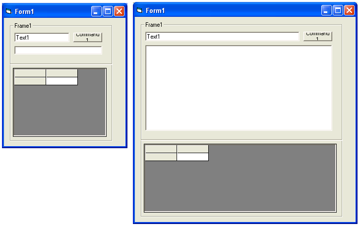



## Anchor class: allows you to anchor any control on its left,top,right,or bottom\.\.\.\.

### Description

The [Anchor] property is a property available to all controls in the .net framework. A control can be anchored to one or more edges of its parent container. Anchoring a control to its parent ensures that the anchored edges remain in the same position relative to the edges of the parent container when the parent container is resized. For example, if you have a Form with a Button whose Anchor property value is set to AnchorStyles.Top and AnchorStyles.Bottom, the Button is stretched to maintain the anchored distance to the top and bottom edges of the Form as the Height of the Form is increased.
 
### More Info
 

             |
---                |---
**Submitted On**   |2006-01-14 21:57:32
**By**             |[dan aprobee](https://github.com/Planet-Source-Code/PSCIndex/blob/master/ByAuthor/dan-aprobee.md)
**Level**          |Intermediate
**User Rating**    |5.0 (10 globes from 2 users)
**Compatibility**  |VB 5\.0, VB 6\.0
**Category**       |[Custom Controls/ Forms/  Menus](https://github.com/Planet-Source-Code/PSCIndex/blob/master/ByCategory/custom-controls-forms-menus__1-4.md)
**World**          |[Visual Basic](https://github.com/Planet-Source-Code/PSCIndex/blob/master/ByWorld/visual-basic.md)
**Archive File**   |[Anchor\_cla1965221142006\.zip](https://github.com/Planet-Source-Code/dan-aprobee-anchor-class-allows-you-to-anchor-any-control-on-its-left-top-right-or-bottom__1-64037/archive/master.zip)

